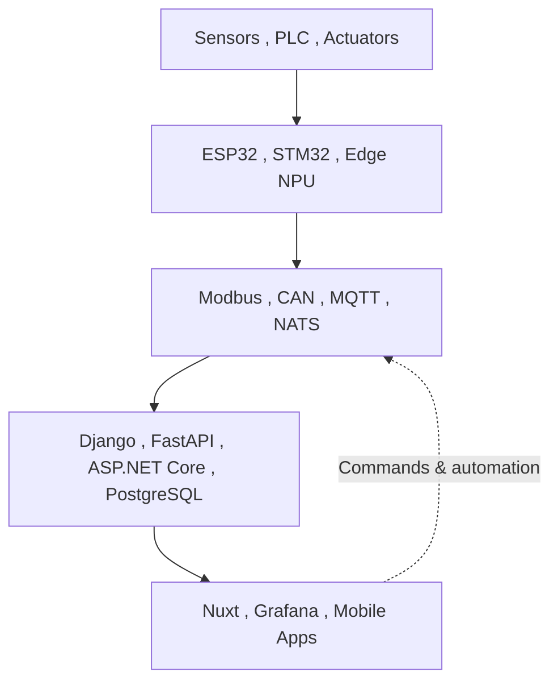

<!--
  GitHub Profile README for github.com/khulqu15
  Install: create a public repository named "khulqu15" and place this file at its root.
-->

<div align="center">

# Hi, I'm Mohammad Khusnul Khuluq (Ninno) 👋

[](https://git.io/typing-svg)

**Industrial IoT , Embedded Systems , Robotics , AI , Modern Web Platforms**

[](https://ninno.obayan.id/)
[](https://www.linkedin.com/in/mohammad-khusnul-khuluq-53b2051b5/)
[](mailto:khusnul.ninno15@gmail.com)
[](https://github.com/khulqu15?tab=followers)


</div>

---

## Engineering beyond the screen

I am an **IoT and Full-Stack Engineer** from Indonesia who enjoys turning real-world problems into reliable, connected products. My work spans the entire engineering chainfrom sensors, embedded firmware, industrial communication, and edge AI to scalable backends, dashboards, and intelligent control.

I currently build industrial connected systems while developing research in **robotics, intelligent control, AI-assisted sensing, and autonomous platforms**. I care about systems that do more than look impressive: they must be measurable, maintainable, safe, and useful in the field.

| | Engineering snapshot |
|---|---|
| 🔭 **Currently building** | Industrial IoT platforms, edge gateways, monitoring systems, and robotic prototypes |
| 🧠 **Researching** | Intelligent UAV control, GNN residual learning, Lyapunov constraints, sensor fusion, and time-series AI |
| 🏭 **Industry focus** | Cold-chain monitoring, automation, telemetry, edge vision, PLC/relay control, and real-time dashboards |
| 🎓 **Education** | Bachelor of Applied Science in Electronics Engineering  PENS, Indonesia |
| 🧭 **Long-term direction** | Advanced robotics and control research, with engineering collaboration in Japan |
| 🌏 **Based in** | Indonesia , Open to global research and engineering collaboration |

---

## What I build



I am most useful where **hardware, intelligence, and software meet**:

- **Device layer:** sensor acquisition, MCU firmware, OTA updates, actuator control, and industrial electronics.
- **Connectivity layer:** Modbus RTU/TCP, RS-485, CAN bus, MQTT, NATS JetStream, REST, BLE, Wi-Fi, LAN, and cellular connectivity.
- **Platform layer:** reusable APIs, event-driven services, telemetry storage, authentication, observability, and deployment.
- **Experience layer:** responsive dashboards, real-time charts, configuration interfaces, alarms, audit trails, and operator workflows.
- **Intelligence layer:** computer vision, forecasting, sensor fusion, adaptive control, and learning-based residual compensation.

---

## Technology stack

### Languages


### Backend, data, and messaging


### Frontend and mobile


### Embedded, robotics, and industrial systems


### AI, vision, and engineering tools


---

## Featured engineering focus

<table>
  <tr>
    <td width="50%" valign="top">
      <a href="./Cuplikan layar 2026-08-06 091108.png">
        
      </a>
      <h3 align="center">Flyght AI Smart Control and Robotics</h3>
      <p align="center">A UAV research workspace for transient tracking, disturbance recovery, digital twin testing, GNN residual learning, Lyapunov safety projection, and real-time flight telemetry.</p>
    </td>
    <td width="50%" valign="top">
      <a href="./Cuplikan layar 2026-08-06 092324.png">
        
      </a>
      <h3 align="center">Embedded Vision with Rockchip</h3>
      <p align="center">Edge AI for camera-based detection, tracking, streaming, and robotic responses using Rockchip RK3588, RKNN, YOLO, OpenCV, and Linux.</p>
    </td>
  </tr>
</table>

<p align="center">
  <sub>RK3588 board image source: <a href="https://docs.radxa.com/en/rock5/rock5b/getting-started/introduction">Radxa ROCK 5B documentation</a>, licensed under CC BY 4.0.</sub>
</p>

---

## Selected engineering work

| Area | What I am building | Core technologies |
|---|---|---|
| **Industrial cold-chain IoT** | Multi-warehouse and chamber monitoring, configurable sensor thresholds, alarms, audit trails, and PLC/relay control | ESP32-C5, Modbus RTU, NATS JetStream, PostgreSQL, Django, Nuxt, Grafana |
| **Panasonic CMMS** | Enterprise maintenance platform supporting equipment records, preventive maintenance, work orders, inspections, and maintenance history | ASP.NET Core, C#, REST API |
| **Intelligent UAV control** | Dual-arm aerial platform with constrained control, residual learning, telemetry, actuator limits, and disturbance evaluation | SMC, GNN, Lyapunov analysis, Python, C++, embedded control |
| **Embedded vision and robotics** | Real-time detection, tracking, RTSP streaming, and autonomous actuator responses on resource-constrained edge hardware | Rockchip RK3588, Luckfox Pico, RKNN, YOLO, OpenCV, C++, ESP32 |
| **Industrial controller hardware** | Modular gateways with isolated I/O, ADC/DAC, RS-485, CAN, Ethernet, relay outputs, and OTA-ready firmware | STM32H7, ESP32-C5, W5500, FreeRTOS, EasyEDA |
| **AI-driven flood monitoring** | Time-series water-level forecasting integrated with sensing and automated pump response | LSTM, GRU, IoT telemetry, Python, TensorFlow |

### Public repositories worth exploring

<table>
  <tr>
    <td width="50%">
      <h3 align="center"><a href="https://github.com/khulqu15/wave-detection-and-analysis">Wave Detection & Analysis</a></h3>
      <p>Computer vision for detecting waves, estimating run-up height, and analyzing coastal wave behavior using optical flow and deep learning.</p>
    </td>
    <td width="50%">
      <h3 align="center"><a href="https://github.com/khulqu15/eco_enzym">Eco Enzym Monitoring</a></h3>
      <p>An IoT monitoring interface for pH, temperature, humidity, ozone, and alcohol during liquid fermentation.</p>
    </td>
  </tr>
  <tr>
    <td width="50%">
      <h3 align="center"><a href="https://github.com/khulqu15/synorgan">Synorgan</a></h3>
      <p>An interactive educational application that helps elementary students learn about human organs through multimedia content.</p>
    </td>
    <td width="50%">
      <h3 align="center"><a href="https://github.com/khulqu15/gesto.app">Gesto</a></h3>
      <p>A Flutter-based application project exploring accessible, cross-platform product experiences.</p>
    </td>
  </tr>
</table>

> Some industrial and research systems are private or under active development. Public case studies are shared through my [portfolio](https://ninno.obayan.id/).

---

## Research and achievements

- Research work around **AI-IoT flood forecasting**, **intelligent UAV control**, and **learning-assisted nonlinear control** for IEEE Industrial Electronics Society venues.
- **3rd Place  GEMASTIK 2023**, with experience taking multidisciplinary technology projects from concept to national competition.
- **PIMNAS / PKM finalist**, working on applied robotics and autonomous delivery systems.
- Active interests in **Sliding Mode Control, PID and optimal control, Kalman filtering, ROS/SLAM, Graph Neural Networks, and physics-guided machine learning**.
- Evaluation mindset centered on reproducible metrics: RMSE, overshoot, settling time, constraint violations, success rate, latency, and resource usage.

<details>
<summary><b>🔬 Open my research notebook</b></summary>

### Current research questions

1. How can learning-based residual models improve nonlinear controllers without compromising stability?
2. How should autonomous systems behave when sensors, actuators, communication, or power constraints are imperfect?
3. How can edge AI remain fast and useful on embedded hardware with limited compute and memory?
4. How can thousands of IoT devices be provisioned, updated, observed, and secured without creating an operations bottleneck?

### Methods I frequently explore

`Sliding Mode Control` , `Lyapunov Stability` , `Graph Neural Networks` , `LSTM/GRU` , `Kalman Filtering` , `Sensor Fusion` , `Computer Vision` , `ROS/SLAM` , `Digital Twins` , `Hardware-in-the-Loop Testing`

</details>

<details>
<summary><b>🧩 Open my engineering principles</b></summary>

- **Design for the real environment.** Heat, noise, unstable networks, failed sensors, and human operators are part of the system.
- **Measure before optimizing.** Decisions should be supported by latency, accuracy, reliability, and resource data.
- **Keep boundaries clear.** Device, transport, domain, data, and presentation layers should evolve without tightly coupling one another.
- **Fail safely and visibly.** Timeouts, fallbacks, audit logs, alarms, and recovery paths are product featuresnot afterthoughts.
- **Build reusable foundations.** A good architecture should make the next device, sensor type, protocol, or interface easier to add.

</details>

---

## GitHub analytics

<div align="center">

<a href="https://github.com/khulqu15">
  
</a>
<a href="https://github.com/khulqu15?tab=repositories">
  
</a>


<sub>Language statistics describe public repositories only and do not represent overall proficiency.</sub>

</div>

---

## Beyond engineering

I enjoy connecting research with product execution, learning Japanese, exchanging ideas with international researchers, and mentoring collaborative projects. My long-term ambition is to contribute to robotics systems that are technically rigorous, economically practical, and genuinely helpful to people.

```text
Build with purpose. Validate with evidence. Improve without ego.
```

---

<div align="center">

## Let's build something useful

I am open to **research collaboration, IoT and robotics projects, intelligent system development, and global engineering opportunities**.

[](https://ninno.obayan.id/)
[](mailto:khusnul.ninno15@gmail.com)

<br />

**Mohammad Khusnul Khuluq (Ninno)**  
*Engineering intelligent systemsfrom physical signals to meaningful decisions.*

</div>
